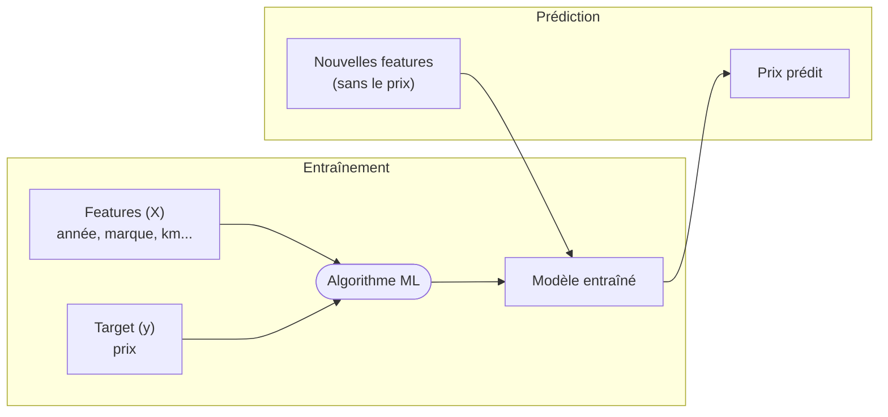
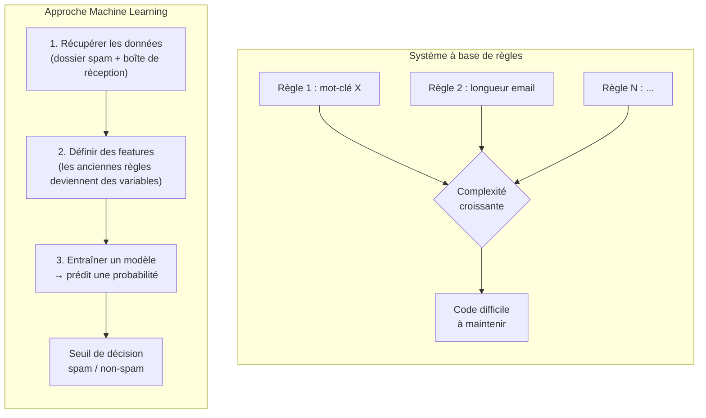
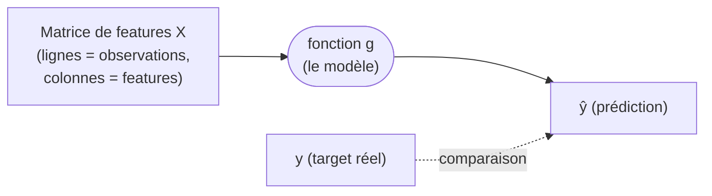
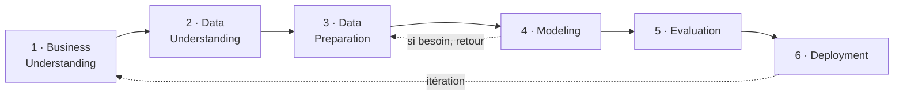
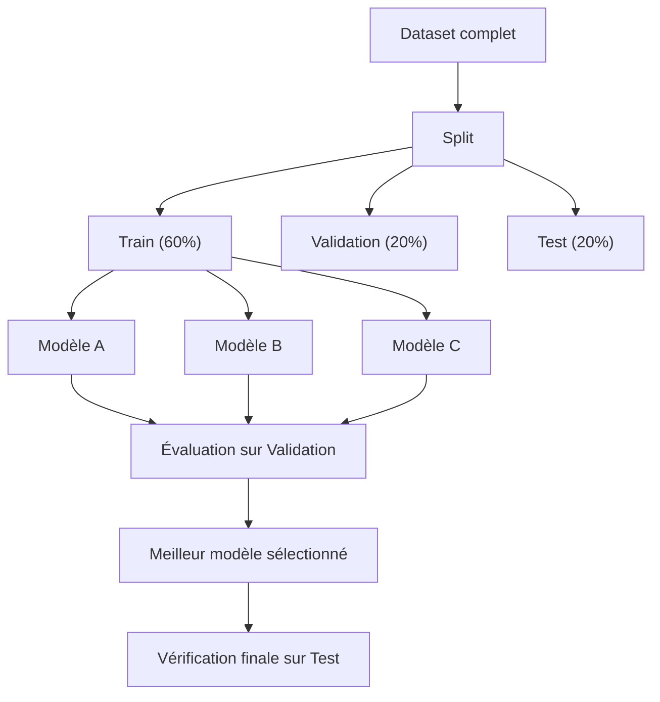
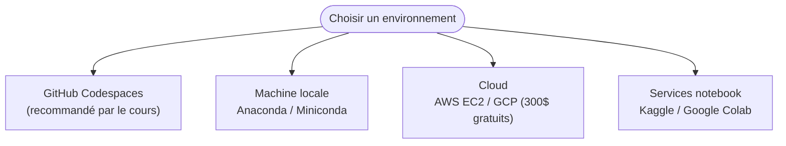
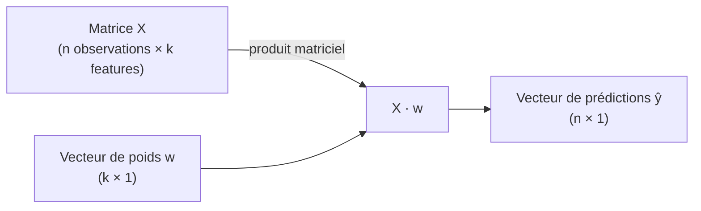
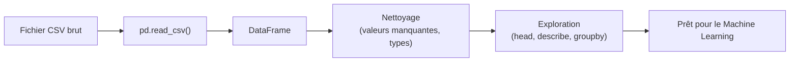
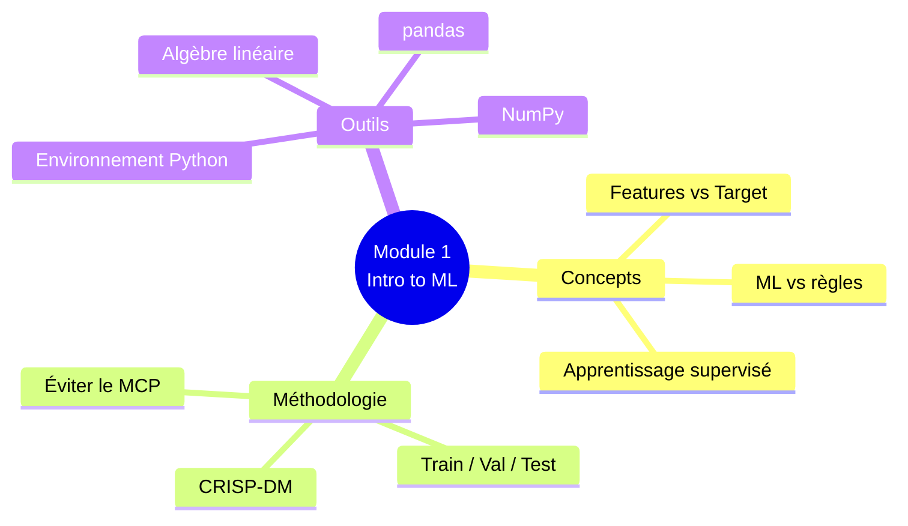

# Module 1 — Introduction to Machine Learning

> Résumé personnel du Module 1 du [Machine Learning Zoomcamp](https://github.com/DataTalksClub/machine-learning-zoomcamp/blob/main/01-intro/README.md) (DataTalksClub).
> Référence : cours original en 10 sous-leçons (1.1 → 1.10).

---

## Sommaire

| # | Leçon | Idée clé |
|---|---|---|
| [1.1](#11--quest-ce-que-le-machine-learning) | Qu'est-ce que le Machine Learning | Un modèle extrait des patterns depuis des données |
| [1.2](#12--ml-vs-systèmes-à-base-de-règles) | ML vs systèmes à base de règles | Le ML remplace des règles infinies par un modèle qui apprend |
| [1.3](#13--apprentissage-supervisé) | Apprentissage supervisé | X (features) → g() → y (target) |
| [1.4](#14--crisp-dm) | CRISP-DM | Méthodologie en 6 étapes, itérative |
| [1.5](#15--sélection-du-modèle) | Sélection du modèle | Train / Validation / Test, éviter le MCP |
| [1.6](#16--mise-en-place-de-lenvironnement) | Mise en place de l'environnement | Python 3.11, conda, Codespaces |
| [1.7](#17--introduction-à-numpy) | Introduction à NumPy | Calcul vectoriel/matriciel performant |
| [1.8](#18--révision-dalgèbre-linéaire) | Révision d'algèbre linéaire | Vecteurs, matrices, produit matriciel, inverse |
| [1.9](#19--introduction-à-pandas) | Introduction à pandas | DataFrame, Series, manipulation tabulaire |
| [1.10](#110--résumé) | Résumé | Vue d'ensemble du module |

---

## 1.1 · Qu'est-ce que le Machine Learning

**Cas d'usage introductif :** un site de vente de voitures d'occasion doit suggérer un prix de vente au vendeur.

Un expert humain estimerait ce prix en observant l'**année**, la **marque**, le **kilométrage**, etc. — il a appris ces patterns en voyant des milliers de voitures. Le Machine Learning reproduit ce raisonnement : au lieu d'un expert, on donne les données à un algorithme qui **extrait lui-même les patterns**.



**Vocabulaire fondamental :**

| Terme | Définition | Exemple |
|---|---|---|
| **Features** | Tout ce qu'on connaît sur l'objet | année, marque, kilométrage |
| **Target** | Ce qu'on veut prédire | prix de la voiture |
| **Training** | Donner features + target à un algorithme pour produire un modèle | — |
| **Modèle** | Artefact unique encapsulant les patterns appris, réutilisable | fichier sauvegardé |

> **En une phrase :** le Machine Learning est un processus d'**extraction de patterns depuis des données** (features + target) pour produire un **modèle** capable de prédire le target sur de nouvelles données.

---

## 1.2 · ML vs systèmes à base de règles

**Exemple de référence :** un filtre anti-spam.

Un système à base de règles code en dur des critères ("si l'email contient tel mot-clé..."). Problème : les spammeurs évoluent en permanence, donc le code doit être mis à jour sans cesse → maintenance intenable.



**Les 3 étapes de la transformation "règles → ML" :**
1. **Obtenir les données** — les emails déjà classés (spam / boîte de réception) servent d'exemples.
2. **Définir les features** — les anciennes règles inspirent les variables (nombre de mots suspects, longueur, expéditeur...).
3. **Entraîner et utiliser le modèle** — le modèle sort une **probabilité** ; un **seuil** (ex. 0.5) transforme cette probabilité en décision binaire.

---

## 1.3 · Apprentissage supervisé

En apprentissage supervisé, chaque exemple est constitué de **features** ET d'un **label connu** (le target). Le modèle apprend une fonction qui relie les deux.



- **Feature matrix (X)** : les lignes sont les observations, les colonnes les features.
- **Target vector (y)** : un vecteur contenant le target de chaque ligne de X.
- **Training** = trouver la fonction **g** telle que `g(X) ≈ y`.

**Les 3 grands types de problèmes supervisés :**

| Type | Sortie | Exemple |
|---|---|---|
| **Régression** | Un nombre continu | Prix d'une voiture |
| **Classification** | Une catégorie | Spam / non-spam (binaire), type d'animal (multiclasse) |
| **Ranking** | Un score de pertinence par item | Système de recommandation |

---

## 1.4 · CRISP-DM

**CRISP-DM** (*Cross-Industry Standard Process for Data Mining*) est la méthodologie la plus utilisée pour structurer un projet data/ML. Créée en 1996, standardisée par un consortium (ISL, Teradata, Daimler, NCR, OHRA).



| Étape | Question centrale |
|---|---|
| **1. Business Understanding** | A-t-on vraiment besoin de ML ? L'objectif est-il mesurable ? |
| **2. Data Understanding** | Quelles données a-t-on ? Faut-il en collecter d'autres ? |
| **3. Data Preparation** | Nettoyer, transformer en format tabulaire exploitable |
| **4. Modeling** | Entraîner plusieurs modèles, choisir le meilleur |
| **5. Evaluation** | Le modèle résout-il vraiment le problème métier ? |
| **6. Deployment** | Mise en production ; l'évaluation continue en ligne |

> **Principe clé :** un projet ML est **itératif**. On commence simple (*start simple*), on apprend du feedback (*learn from feedback*), on améliore (*improve*) — puis on recommence.

---

## 1.5 · Sélection du modèle

**Problème :** comment choisir objectivement le meilleur modèle parmi plusieurs candidats (régression logistique, arbre de décision, réseau de neurones...) ?



**Pourquoi 3 datasets et pas 2 ?**

Le **Multiple Comparisons Problem (MCP)** : en testant plusieurs modèles, l'un d'eux peut sembler bon **par pur hasard**. Le jeu de **test** sert de garde-fou final, complètement indépendant du processus de sélection.

**Procédure recommandée :**
1. Split train / validation / test (ex. 60/20/20).
2. Entraîner chaque modèle candidat sur *train*.
3. Évaluer chaque modèle sur *validation*.
4. Sélectionner le meilleur.
5. Vérifier sa performance sur *test* (jamais vu auparavant).
6. *(Optionnel)* Réentraîner le modèle choisi sur train + validation réunis, avant le test final.

---

## 1.6 · Mise en place de l'environnement

**Stack requis pour tout le cours :**

| Outil | Rôle |
|---|---|
| Python 3.11 | Langage principal |
| NumPy / pandas / scikit-learn | Calcul, manipulation de données, modèles |
| Matplotlib / Seaborn | Visualisation |
| Jupyter Notebook | Environnement de travail interactif |

**Options d'installation (au choix) :**



**Création rapide de l'environnement avec conda :**

```bash
conda create -n ml-zoomcamp python=3.11
conda activate ml-zoomcamp
conda install numpy pandas scikit-learn seaborn jupyter
```

> XGBoost et TensorFlow seront installés plus tard (modules 6 et 8).

---

## 1.7 · Introduction à NumPy

NumPy fournit des **tableaux (arrays)** multidimensionnels et des opérations vectorisées bien plus rapides que les boucles Python classiques — c'est la fondation de tout le calcul scientifique en Python (pandas et scikit-learn reposent dessus).

**Les briques essentielles à maîtriser :**

| Concept | Exemple |
|---|---|
| Création d'array | `np.array([1, 2, 3])`, `np.zeros(5)`, `np.ones(5)`, `np.linspace(0, 1, 10)` |
| Indexation / slicing | `a[0]`, `a[1:3]`, `a[:, 0]` (pour une matrice) |
| Opérations élément par élément | `a + b`, `a * 2`, `a ** 2` |
| Fonctions statistiques | `a.mean()`, `a.std()`, `a.min()`, `a.max()` |
| Reshape | `a.reshape(3, 2)` |
| Générateur aléatoire | `np.random.rand(...)`, `np.random.seed(...)` (reproductibilité) |

> **Pourquoi c'est important :** les modèles ML manipulent des matrices de features — comprendre NumPy, c'est comprendre comment ces données circulent "sous le capot" de scikit-learn.

---

## 1.8 · Révision d'algèbre linéaire

Deux opérations reviennent partout dans le ML, en particulier en régression :

**1. Produit scalaire (dot product) entre deux vecteurs :**

```
u · v = Σ (uᵢ × vᵢ)
```

C'est l'opération de base d'un neurone ou d'une régression linéaire : chaque prédiction est un produit scalaire entre un vecteur de **poids** et un vecteur de **features**.

**2. Produit matrice-vecteur et matrice-matrice :**



**3. Matrice identité et matrice inverse :**

- La matrice **identité I** est l'équivalent matriciel du nombre 1 (`A · I = A`).
- L'**inverse** d'une matrice carrée `A⁻¹` vérifie `A · A⁻¹ = I` — c'est la clé de la résolution analytique de la régression linéaire (équation normale), vue en détail au Module 2.

> Ces notions ne sont pas juste théoriques : elles expliquent *pourquoi* `LinearRegression().fit()` fonctionne mathématiquement.

---

## 1.9 · Introduction à pandas

Pandas est la bibliothèque de **manipulation de données tabulaires** en Python : c'est l'outil qu'on utilise pour explorer, nettoyer et transformer un dataset avant de l'envoyer à un modèle.

**Les deux structures de données clés :**

| Structure | Description |
|---|---|
| `Series` | Une colonne unique (tableau 1D indexé) |
| `DataFrame` | Un tableau 2D (lignes × colonnes), comme une feuille Excel |

**Opérations indispensables :**

```python
import pandas as pd

df = pd.read_csv("data.csv")      # charger un fichier
df.head()                          # aperçu des 1res lignes
df.info()                          # types de colonnes, valeurs manquantes
df.describe()                      # statistiques descriptives
df["colonne"]                      # sélectionner une colonne (Series)
df[df["prix"] > 10000]             # filtrer des lignes
df.isnull().sum()                  # compter les valeurs manquantes
df.groupby("marque")["prix"].mean()# agrégation par groupe
```



---

## 1.10 · Résumé



**Ce qu'il faut retenir de ce module :**
- Le ML transforme des **données (features + target)** en un **modèle** capable de généraliser à de nouvelles observations.
- Le ML remplace avantageusement les systèmes à règles quand ces dernières deviennent trop nombreuses ou instables dans le temps.
- **CRISP-DM** structure un projet ML en 6 étapes itératives, du besoin métier jusqu'au déploiement.
- La sélection de modèle exige une séparation stricte **train / validation / test** pour éviter de choisir un modèle "chanceux".
- **NumPy**, l'**algèbre linéaire** et **pandas** sont les fondations techniques indispensables avant d'attaquer la régression (Module 2).

---

## Ressources complémentaires

- [Playlist YouTube du module](https://www.youtube.com/playlist?list=PL3MmuxUbc_hIhxl5Ji8t4O6lPAOpHaCLR)
- [FAQ officielle du cours](https://datatalks.club/faq/machine-learning-zoomcamp.html)
- [README source du Module 1](https://github.com/DataTalksClub/machine-learning-zoomcamp/blob/main/01-intro/README.md)