# Module 2 — Machine Learning for Regression

> Résumé personnel du Module 2 du [Machine Learning Zoomcamp](https://github.com/DataTalksClub/machine-learning-zoomcamp/blob/master/02-regression/README.md) (DataTalksClub).
> Fil rouge du module : **prédire le prix d'une voiture** à partir de ses caractéristiques (dataset Kaggle, colonne cible `msrp`).

---

## Sommaire

| # | Leçon | Idée clé |
|---|---|---|
| [2.1](#21--le-projet-car-price-prediction) | Projet de prédiction du prix | Prédire `msrp` à partir des autres colonnes |
| [2.2](#22--préparation-des-données) | Préparation des données | Noms de colonnes et valeurs homogènes (minuscules, `_`) |
| [2.3](#23--analyse-exploratoire-eda) | EDA | Longue queue du prix, log-transformation, valeurs manquantes |
| [2.4](#24--cadre-de-validation) | Validation framework | Split 60/20/20 avec shuffle |
| [2.5](#25--régression-linéaire-cas-dune-voiture) | Régression linéaire simple | `g(x) = w0 + Σ wj·xj` |
| [2.6](#26--régression-linéaire-forme-vectorielle) | Forme vectorielle | Produit scalaire puis produit matrice-vecteur |
| [2.7](#27--entraînement--équation-normale) | Équation normale | `w = (XᵀX)⁻¹ Xᵀ y` |
| [2.8](#28--modèle-baseline) | Baseline | 5 variables numériques, NA remplis avec 0 |
| [2.9](#29--rmse) | RMSE | Mesure objective de l'erreur |
| [2.10](#210--rmse-sur-la-validation) | RMSE sur validation | Toujours évaluer sur des données non vues |
| [2.11](#211--feature-engineering) | Feature engineering | `age = 2017 - year` |
| [2.12](#212--variables-catégorielles) | Variables catégorielles | Encodage en colonnes binaires |
| [2.13](#213--régularisation) | Régularisation | Ajouter `r` à la diagonale de XᵀX |
| [2.14](#214--réglage-du-modèle-tuning) | Tuning | Choisir `r` avec la validation |
| [2.15](#215--utiliser-le-modèle) | Utiliser le modèle | Full train, test, prédiction d'une voiture |
| [2.16](#216--résumé) | Résumé | Vue d'ensemble |
| [2.17](#217--pour-aller-plus-loin) | Explorer plus | Autres datasets de régression |

---

## Vue d'ensemble du module

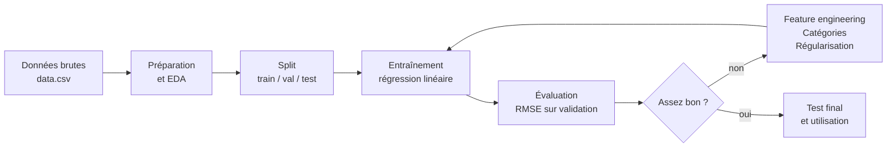

Chaque leçon ajoute une brique à ce cycle. La méthode reste la même tout au long du module : **changer une chose, recalculer le RMSE sur la validation, garder si le score baisse.**

---

## 2.1 · Le projet Car Price Prediction

**Scénario :** un utilisateur veut vendre sa voiture sur un site d'annonces. Le site lui demande un prix. Notre modèle lui **suggère un prix** à partir des caractéristiques du véhicule.

- **Dataset :** voitures Kaggle (marque, modèle, année, type de carburant, transmission, etc.).
- **Cible :** `msrp` (Manufacturer Suggested Retail Price), soit le prix.
- **Features :** toutes les autres colonnes.

Plan du projet :

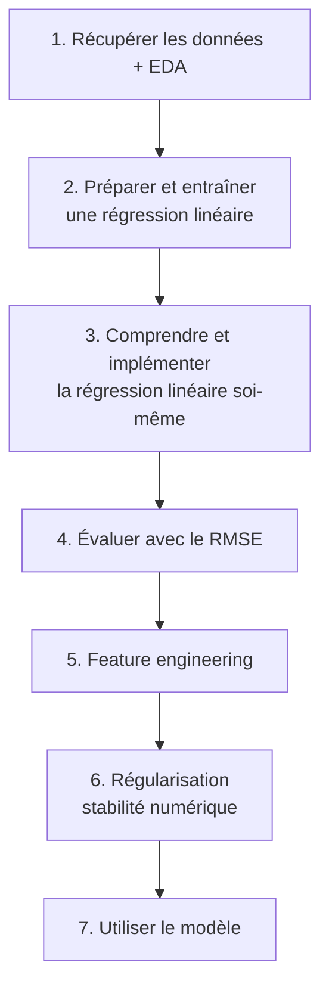

---

## 2.2 · Préparation des données

Chargement et nettoyage minimal avec pandas :

```python
import pandas as pd
df = pd.read_csv('data.csv')
df.head()
```

**Problème :** les noms de colonnes sont incohérents (`Make`, `Engine Fuel Type`, `Driven_Wheels`). Les espaces empêchent la notation pointée (`df.Transmission Type` est une erreur de syntaxe).

**Solution :** tout en minuscules, espaces remplacés par `_`.

```python
df.columns = df.columns.str.lower().str.replace(' ', '_')
```

Même traitement pour les **valeurs** des colonnes texte (type `object` en pandas) :

```python
strings = list(df.dtypes[df.dtypes == 'object'].index)

for col in strings:
    df[col] = df[col].str.lower().str.replace(' ', '_')
```

| Avant | Après |
|---|---|
| `Engine Fuel Type` | `engine_fuel_type` |
| `BMW`, `MANUAL` | `bmw`, `manual` |

---

## 2.3 · Analyse exploratoire (EDA)

**Objectif :** comprendre chaque colonne avant de modéliser.

```python
for col in df.columns:
    print(col)
    print(df[col].unique()[:5])
    print(df[col].nunique())
```

**Distribution du prix :** un histogramme (`sns.histplot(df.msrp, bins=50)`) montre une **longue queue** : la plupart des voitures sont peu chères, très peu coûtent des millions.

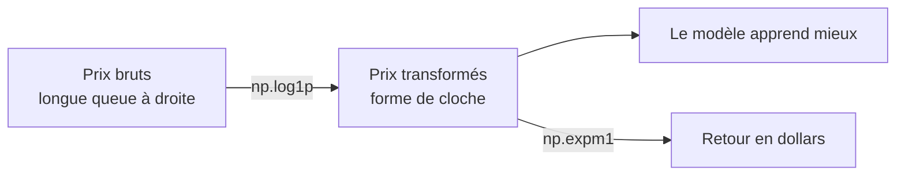

**Pourquoi la queue pose problème :** quelques valeurs énormes « perturbent » le modèle. Le logarithme **compresse les grandes valeurs** : passer de 10 à 1000 est un grand saut, mais l'écart entre leurs logarithmes est bien plus petit.

**Pourquoi `log1p` et pas `log` :** `log(0)` n'existe pas. `log1p(x) = log(x + 1)` gère les zéros.

```python
price_logs = np.log1p(df.msrp)
```

**Valeurs manquantes :** `df.isnull().sum()` compte les NaN par colonne (ex. `engine_hp` : 69, `engine_cylinders` : 30, `market_category` : 3742). Un modèle ne s'entraîne pas avec des NaN, il faudra les traiter.

---

## 2.4 · Cadre de validation

On coupe le dataset en trois parties :

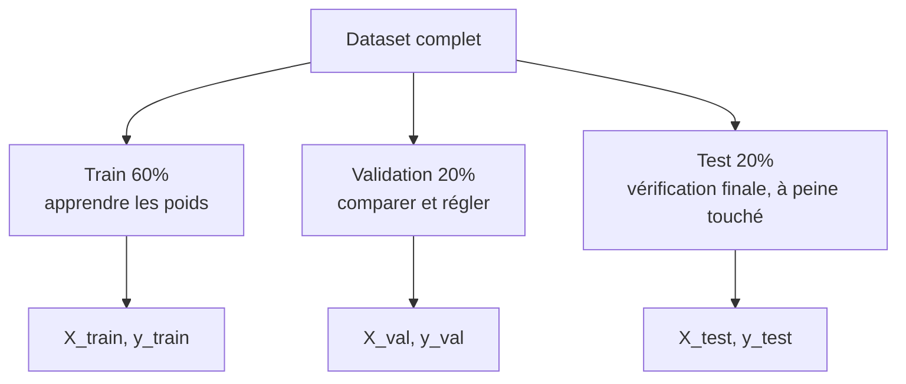

**Calcul des tailles** (sans arrondir train, pour ne perdre aucun enregistrement) :

```python
n = len(df)
n_val = int(n * 0.2)
n_test = int(n * 0.2)
n_train = n - n_val - n_test
```

**Shuffle obligatoire :** le dataset est trié par marque. Un découpage séquentiel mettrait toutes les BMW en validation et aucune en train.

```python
idx = np.arange(n)
np.random.seed(2)          # reproductibilité
np.random.shuffle(idx)

df_train = df.iloc[idx[:n_train]]
df_val   = df.iloc[idx[n_train:n_train+n_val]]
df_test  = df.iloc[idx[n_train+n_val:]]
```

Ensuite : `reset_index(drop=True)`, création de `y_train`, `y_val`, `y_test` avec `np.log1p(df.msrp.values)`, puis **suppression de `msrp`** des dataframes pour ne pas la donner comme feature.

---

## 2.5 · Régression linéaire (cas d'une voiture)

La régression linéaire prédit un **nombre**. Le modèle `g` transforme les features en prédiction : `g(X) ≈ y`.

**Pour une voiture `xi` avec `n` features :**

$$g(x_i) = w_0 + \sum_{j=1}^{n} w_j \cdot x_{ij}$$

- `w0` : le **biais** (prédiction sans rien savoir de la voiture)
- `wj` : le **poids** de la feature `j`

**Exemple du cours :** `xi = [453, 11, 86]` (chevaux, mpg en ville, popularité), `w0 = 7.17`, `w = [0.01, 0.04, 0.002]`.

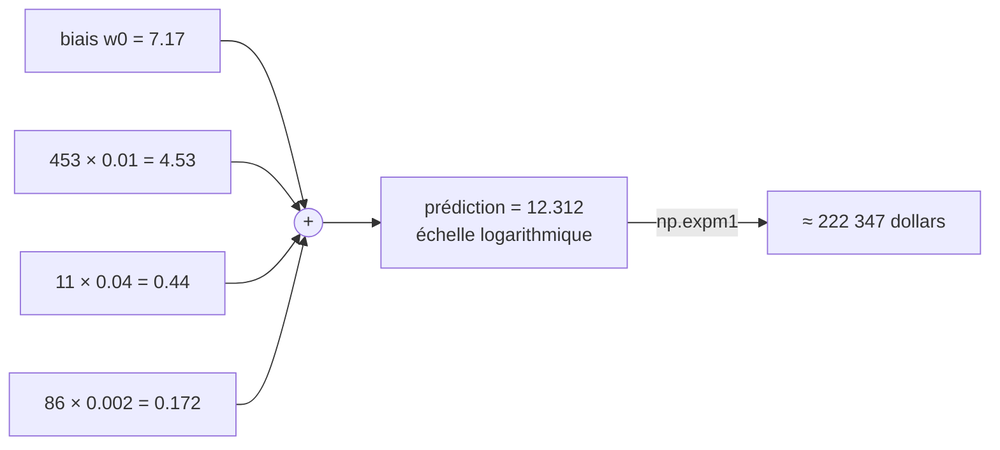

**Lecture des poids :** chaque cheval supplémentaire ajoute 0.01 à la prédiction (log du prix), donc plus de puissance = plus cher.

**Attention :** 12.312 n'est **pas** un prix en dollars, c'est un logarithme. Il faut appliquer `np.expm1` pour revenir aux dollars.

---

## 2.6 · Régression linéaire, forme vectorielle

**Étape 1 : la somme est un produit scalaire.**

$$g(x_i) = w_0 + x_i^T w$$

**Étape 2 : la feature fictive.** On ajoute `xi0 = 1` devant chaque vecteur de features, et `w0` devant le vecteur de poids. Le biais rentre alors dans le produit scalaire.

```python
w_new = [w0] + w
xi = [1] + xi
dot(xi, w_new)      # même résultat : 12.312
```

**Étape 3 : toutes les voitures d'un coup.** Chaque ligne de `X` a un `1` en première colonne, et la prédiction devient un **produit matrice-vecteur** :

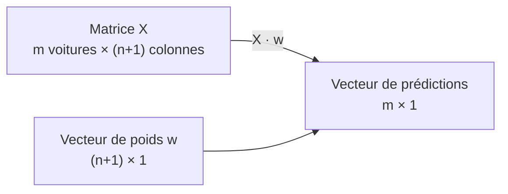

```python
def linear_regression(X):
    return X.dot(w_new)
```

---

## 2.7 · Entraînement : l'équation normale

**Question :** d'où viennent les poids `w` ? On veut `Xw ≈ y`.

**Idée naïve :** multiplier par `X⁻¹`. Impossible : `X` est **rectangulaire** (beaucoup de lignes, peu de colonnes), donc non inversible.

**Astuce :** multiplier par `Xᵀ` des deux côtés pour obtenir une matrice carrée, la **matrice de Gram** `XᵀX` de taille `(n+1) × (n+1)`.

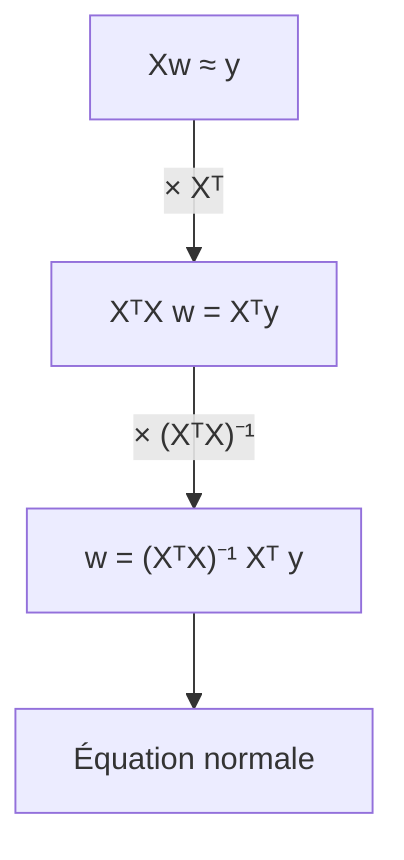

$$w = (X^T X)^{-1} X^T y$$

Ce `w` n'est pas une solution exacte (elle n'existe pas) mais la **solution la plus proche** au sens des moindres carrés.

**Implémentation NumPy :**

```python
def train_linear_regression(X, y):
    ones = np.ones(X.shape[0])
    X = np.column_stack([ones, X])      # ajoute la colonne de 1

    XTX = X.T.dot(X)
    XTX_inv = np.linalg.inv(XTX)
    w_full = XTX_inv.dot(X.T).dot(y)

    return w_full[0], w_full[1:]        # biais, poids
```

> Le machine learning n'est pas magique : entraîner une régression linéaire, c'est appliquer une formule.

---

## 2.8 · Modèle baseline

Premier modèle volontairement simple : uniquement des variables **numériques**.

```python
base = ['engine_hp', 'engine_cylinders', 'highway_mpg',
        'city_mpg', 'popularity']
X_train = df_train[base].values
```

**Problème :** l'entraînement renvoie `nan` pour `w0` et `w`. Cause : valeurs manquantes dans `engine_hp` et `engine_cylinders`.

**Solution rapide : remplir avec 0.**

```python
X_train = df_train[base].fillna(0).values
```

**Pourquoi ça marche :** une feature à 0 fait disparaître son terme `xi1 · w1` de la formule, le modèle l'ignore simplement pour cette ligne.

```text
g(xi) = w0 + 0·w1 + xi2·w2  =  w0 + xi2·w2
```

Le remplissage par la moyenne est plus « logique », mais 0 est plus simple et fonctionne souvent bien. On obtient `w0 ≈ 7.93`. En comparant les histogrammes des prédictions et des vraies valeurs, on voit que le modèle est **un peu décalé** : il faut une mesure objective.

---

## 2.9 · RMSE

**Root Mean Squared Error** : une seule valeur qui mesure la qualité d'un modèle de régression.

$$RMSE = \sqrt{\frac{1}{m} \sum_{i=1}^{m} (g(x_i) - y_i)^2}$$

**Exemple pas à pas (4 observations) :**

| | prédiction | réel | erreur | erreur² |
|---|---:|---:|---:|---:|
| 1 | 10 | 9 | 1 | 1 |
| 2 | 9 | 9 | 0 | 0 |
| 3 | 11 | 10.5 | 0.5 | 0.25 |
| 4 | 10 | 11.5 | -1.5 | 2.25 |

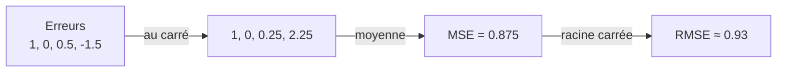

- **Le carré** empêche les erreurs positives et négatives de s'annuler, et **pénalise davantage les grosses erreurs**.
- **La racine** ramène l'erreur dans la même unité que la cible.

```python
def rmse(y, y_pred):
    se = (y - y_pred) ** 2
    mse = se.mean()
    return np.sqrt(mse)
```

RMSE de la baseline sur le train : **0.755**. Plus le RMSE est bas, meilleur est le modèle.

---

## 2.10 · RMSE sur la validation

Mesurer sur les données d'entraînement est trompeur : le modèle les a déjà vues. On évalue sur la **validation**.

On regroupe la préparation dans une fonction, appliquée **de la même façon** à train, validation et test :

```python
def prepare_X(df):
    df_num = df[base]
    df_num = df_num.fillna(0)
    return df_num.values
```

```python
X_train = prepare_X(df_train)
w0, w = train_linear_regression(X_train, y_train)

X_val = prepare_X(df_val)
y_pred = w0 + X_val.dot(w)
rmse(y_val, y_pred)        # 0.7617
```

Score proche de celui du train (0.755) : le modèle se comporte à peu près aussi bien sur des données inconnues.

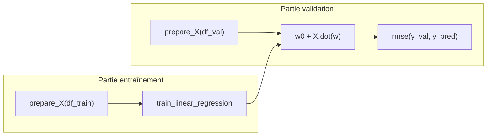

Cette structure permet d'expérimenter vite : on redéfinit `prepare_X`, on relance la même cellule de validation.

---

## 2.11 · Feature engineering

Créer de **nouvelles features** à partir de celles qui existent.

**Exemple : l'âge de la voiture.** Les données datent de 2017 :

```python
df['age'] = 2017 - df.year
```

```python
def prepare_X(df):
    df = df.copy()                   # ne pas modifier le dataframe d'origine
    features = base + ['age']
    df['age'] = 2017 - df.year
    df_num = df[features].fillna(0)
    return df_num.values
```

**Bonne pratique :** `df.copy()` au début de la fonction. Sinon la fonction ajoute des colonnes au dataframe de l'appelant, effet de bord indésirable.

**Résultat :** RMSE validation **0.76 → 0.517**. Amélioration importante, avec une seule feature.

---

## 2.12 · Variables catégorielles

Variables qui contiennent des **catégories** (`make`, `model`, `engine_fuel_type`, `transmission_type`, `driven_wheels`...).

**Piège :** `number_of_doors` contient 2, 3, 4 (des nombres) mais ce sont des **catégories** (une voiture à 2 portes n'est pas « la moitié » d'une à 4 portes).

**Encodage : une colonne binaire par valeur.**

| number_of_doors | num_doors_2 | num_doors_3 | num_doors_4 |
|---:|---:|---:|---:|
| 2 | 1 | 0 | 0 |
| 3 | 0 | 1 | 0 |
| 4 | 0 | 0 | 1 |
| 2 | 1 | 0 | 0 |

Chaque ligne a exactement un `1`. Cet encodage s'appelle **one-hot encoding**.

```python
for v in [2, 3, 4]:
    df['num_doors_%s' % v] = (df.number_of_doors == v).astype('int')
    features.append('num_doors_%s' % v)
```

On peut l'appliquer à plusieurs colonnes (ex. les marques les plus fréquentes). Point d'attention : **copier la liste `base`** (`features = base.copy()`) sinon chaque appel de `prepare_X` allongerait `base`.

**Problème :** en ajoutant beaucoup de variables catégorielles, le RMSE **explose à 41** et les poids deviennent énormes. La leçon suivante explique pourquoi.

---

## 2.13 · Régularisation

**Cause du problème :** l'équation normale a besoin de `(XᵀX)⁻¹`, et cet inverse **n'existe pas toujours**.

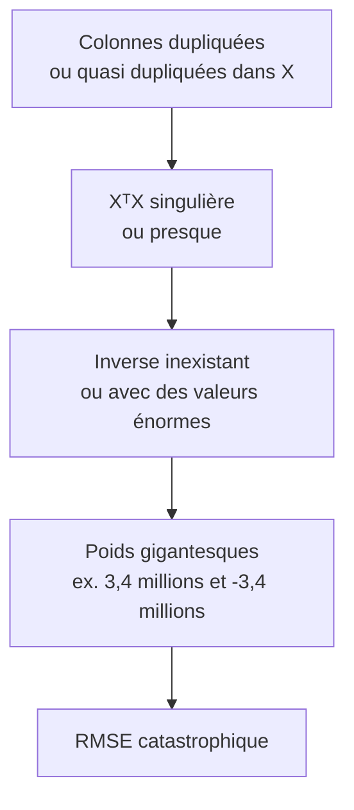

- Colonnes **identiques** : l'inverse n'existe pas, NumPy lève une erreur (matrice singulière).
- Colonnes **quasi identiques** (bruit type `5.00000001`) : l'inverse existe mais contient des nombres de l'ordre de 10¹⁴.

**Solution : ajouter un petit nombre `r` sur la diagonale de XᵀX.**

$$w = (X^T X + rI)^{-1} X^T y$$

Plus `r` est grand, plus on contrôle les poids.

```python
def train_linear_regression_reg(X, y, r=0.001):
    ones = np.ones(X.shape[0])
    X = np.column_stack([ones, X])

    XTX = X.T.dot(X)
    XTX = XTX + r * np.eye(XTX.shape[0])     # seule ligne ajoutée

    XTX_inv = np.linalg.inv(XTX)
    w_full = XTX_inv.dot(X.T).dot(y)

    return w_full[0], w_full[1:]
```

Avec `r = 0.01` : RMSE validation **0.4608**, bien meilleur que les 41 précédents, et même meilleur que le modèle d'avant l'ajout des catégories.

| `r` | Effet |
|---|---|
| `0` | Régression linéaire classique, risque d'explosion des poids |
| petit | Poids stabilisés |
| trop grand | Le modèle se dégrade |

---

## 2.14 · Réglage du modèle (tuning)

`r` est un **paramètre** à choisir. On essaie plusieurs valeurs et on regarde le RMSE sur la **validation**.

```python
for r in [0.0, 0.00001, 0.0001, 0.001, 0.1, 1, 10]:
    X_train = prepare_X(df_train)
    w0, w = train_linear_regression_reg(X_train, y_train, r=r)

    X_val = prepare_X(df_val)
    y_pred = w0 + X_val.dot(w)
    print(r, w0, rmse(y_val, y_pred))
```

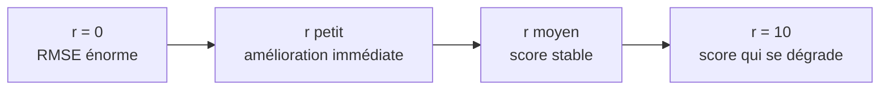

Constats : sans régularisation le biais et le RMSE sont énormes ; dès qu'on ajoute un peu de `r`, le score s'améliore ; plus `r` monte, plus le biais diminue, puis le score se dégrade. Le cours retient `r = 0.001` (RMSE validation **0.4608**).

---

## 2.15 · Utiliser le modèle

**Modèle final :** on **combine train + validation** (plus de données) avec le `r` choisi, puis on évalue sur le **test**, gardé intact jusque-là.

```python
df_full_train = pd.concat([df_train, df_val]).reset_index(drop=True)
X_full_train = prepare_X(df_full_train)
y_full_train = np.concatenate([y_train, y_val])

w0, w = train_linear_regression_reg(X_full_train, y_full_train, r=0.001)

X_test = prepare_X(df_test)
y_pred = w0 + X_test.dot(w)
rmse(y_test, y_pred)               # 0.4601
```

RMSE test (**0.4601**) presque identique à la validation (0.4608) : le modèle **généralise bien**, son score n'est pas dû au hasard.

**Prédire le prix d'une voiture :**

```python
car = df_test.iloc[20].to_dict()          # dictionnaire des caractéristiques
df_small = pd.DataFrame([car])
X_small = prepare_X(df_small)
y_pred = w0 + X_small.dot(w)
np.expm1(y_pred)                          # retour en dollars
```


---

## 2.16 · Résumé

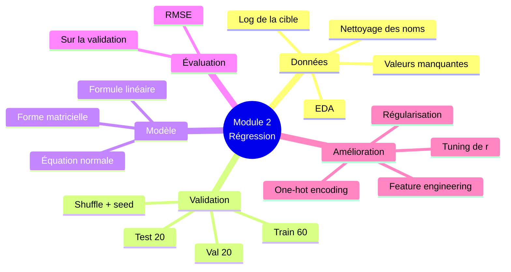

**Ce qu'il faut retenir :**

| Sujet | À retenir |
|---|---|
| Cible | Log-transformer une cible à longue queue (`log1p`), revenir avec `expm1` |
| Validation | Toujours séparer train / validation / test, avec shuffle |
| Modèle | `w = (XᵀX)⁻¹ Xᵀ y`, avec une colonne de 1 pour le biais |
| Métrique | RMSE, à calculer sur la validation, pas sur le train |
| NA | Remplir avec 0 (simple) ou avec la moyenne calculée sur le train |
| Catégories | One-hot encoding : une colonne binaire par valeur |
| Instabilité | Colonnes (quasi) dupliquées, inverse énorme, poids énormes |
| Régularisation | Ajouter `r` à la diagonale de XᵀX, choisir `r` sur la validation |
| Modèle final | Train + validation combinés, évaluation unique sur le test |

**Progression du RMSE sur la validation (fil rouge du module) :**

| Étape | RMSE validation |
|---|---:|
| Baseline (5 features numériques) | 0.762 |
| + feature `age` | 0.517 |
| + variables catégorielles, sans régularisation | 41 (modèle cassé) |
| + régularisation `r = 0.01` | 0.461 |
| `r = 0.001`, évaluation finale sur le test | 0.460 |

---

## 2.17 · Pour aller plus loin

- Question libre du cours : et si on utilisait **10 features** au lieu de 5 ? (non noté)
- Autres datasets de régression : [California housing](https://scikit-learn.org/stable/modules/generated/sklearn.datasets.fetch_california_housing.html), [Student Performance](https://archive.ics.uci.edu/ml/datasets/Student+Performance), [UCI ML Repository](https://archive.ics.uci.edu/ml/datasets.php?task=reg).

---

## Ressources

- [README source du Module 2](https://github.com/DataTalksClub/machine-learning-zoomcamp/blob/master/02-regression/README.md)
- [Playlist YouTube du cours](https://www.youtube.com/playlist?list=PL3MmuxUbc_hIhxl5Ji8t4O6lPAOpHaCLR)
- [FAQ officielle](https://datatalks.club/faq/machine-learning-zoomcamp.html)