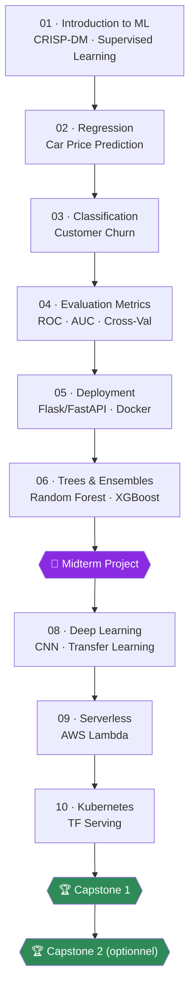

<div align="center">

# 🤖 Machine Learning Zoomcamp 2026

### From Data to Deployed Model — A Structured ML Engineering Journey

[](https://github.com/DataTalksClub/machine-learning-zoomcamp)
[](https://courses.datatalks.club/ml-zoomcamp-2026/)
[]()
[]()

[]()
[]()
[]()
[]()
[]()
[]()
[]()
[]()

</div>

---

## 👋 À propos

Ce repo documente mon parcours complet dans le **[Machine Learning Zoomcamp 2026](https://github.com/DataTalksClub/machine-learning-zoomcamp)** de DataTalks.Club : un cursus gratuit et pratique qui va de l'introduction au Machine Learning jusqu'au déploiement de modèles en production (Docker, Kubernetes, Serverless).

Chaque module contient :
- 📓 **Mes notes** — résumé personnel des concepts (pas un copier-coller des slides)
- 💻 **Mon homework** — notebooks résolus
- 🔗 **Mes liens "learning in public"**

> **Objectif certification :** valider 2 projets sur 3 (Midterm + Capstone, ou Capstone 1 + 2), chacun avec un **modèle réellement déployé** et 3 peer-reviews complétées.

---

## 🗺️ Roadmap du cursus



---

## 📊 Progression

<!-- Mets à jour les emojis au fil de l'eau : ⏳ à faire · 🔄 en cours · ✅ terminé -->

| # | Module | Notes | Homework | Statut |
|:-:|---|:-:|:-:|:-:|
| 01 | Introduction to Machine Learning | [📓](01-intro/notes.md) | [💻](01-intro/homework/) | 🔄 |
| 02 | Machine Learning for Regression | [📓](02-regression/notes.md) | [💻](02-regression/homework/) | ⏳ |
| 03 | Machine Learning for Classification | [📓](03-classification/notes.md) | [💻](03-classification/homework/) | ⏳ |
| 04 | Evaluation Metrics for Classification | [📓](04-evaluation/notes.md) | [💻](04-evaluation/homework/) | ⏳ |
| 05 | Deploying Machine Learning Models | [📓](05-deployment/notes.md) | [💻](05-deployment/homework/) | ⏳ |
| 06 | Decision Trees & Ensemble Learning | [📓](06-trees/notes.md) | [💻](06-trees/homework/) | ⏳ |
| 🎯 | **Midterm Project** | — | [🔗](midterm-project/) | ⏳ |
| 08 | Neural Networks & Deep Learning | [📓](08-deep-learning/notes.md) | [💻](08-deep-learning/homework/) | ⏳ |
| 09 | Serverless Deep Learning | [📓](09-serverless/notes.md) | [💻](09-serverless/homework/) | ⏳ |
| 10 | Kubernetes & TensorFlow Serving | [📓](10-kubernetes/notes.md) | [💻](10-kubernetes/homework/) | ⏳ |
| 🏆 | **Capstone Project 1** | — | [🔗](capstone-1/) | ⏳ |
| 🏆 | **Capstone Project 2** *(optionnel)* | — | [🔗](capstone-2/) | ⏳ |

**Avancement global :** ▓░░░░░░░░░░░ `1/12`

---

## 📁 Structure du repo

```
ml-zoomcamp-2026/
├── 01-intro/
│   ├── notes.md
│   └── homework/
│       └── homework_01.ipynb
├── 02-regression/
├── 03-classification/
├── 04-evaluation/
├── 05-deployment/
├── 06-trees/
├── 08-deep-learning/
├── 09-serverless/
├── 10-kubernetes/
├── midterm-project/        → lien vers repo dédié
├── capstone-1/              → lien vers repo dédié
├── capstone-2/              → lien vers repo dédié
└── README.md
```

---

## 🚀 Projets

| Projet | Description | Dataset | Déploiement | Repo |
|---|---|---|---|---|
| Midterm | *à définir* | *à définir* | *à définir* | — |
| Capstone 1 | *à définir* | *à définir* | *à définir* | — |
| Capstone 2 | *à définir* | *à définir* | *à définir* | — |

> ⚠️ Règle du cours : dataset **inédit** (jamais utilisé en cours), public, >100 lignes — modèle **obligatoirement déployé** (FastAPI+Docker, AWS Lambda, Streamlit/Gradio ou Kubernetes).

---

## 📢 Learning in Public

- 🔗 *lien 1*
- 🔗 *lien 2*

---

## 🔗 Liens utiles

- 📚 [Matériel du cours](https://github.com/DataTalksClub/machine-learning-zoomcamp)
- 🖥️ [Plateforme de soumission](https://courses.datatalks.club/ml-zoomcamp-2026/)
- 💬 [Slack DataTalks.Club](https://datatalks.club/slack.html)
- ❓ [FAQ officielle](https://datatalks.club/faq/machine-learning-zoomcamp.html)

---

<div align="center">

**Abdoulaye "Bou" DJIGO** · Data Engineering Student @ Orange Digital Center, Dakar
*Formé via Sonatel Académie — DEV DATA P8*

</div>